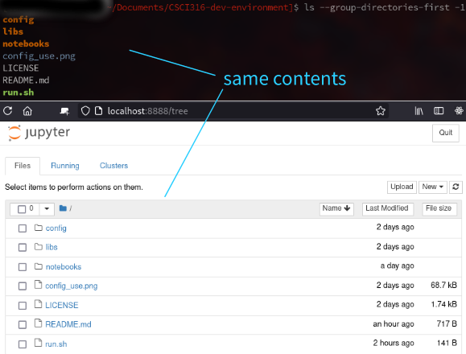
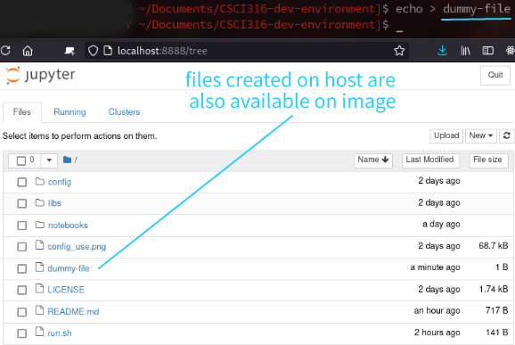

#### Disclaimer:

The contents of this repository are heavily adapted from
[this post](https://towardsdatascience.com/how-to-setup-your-jupyterlab-project-environment-74909dade29b)
and [JupyterLab-Configuration](https://github.com/frankzickert/jupyterlab-configuration). 
The aim is to enable quick and fuss-free setup for a portable development environment for CSCI316 module.
---

# Setup Guide

## Linux

1. Install [Docker](https://docs.docker.com/engine/install/) (Google how to do this on your distro)
2. `git clone` this repository into a directory of your choice
3. Open a terminal and `cd` to your project directory
4. Execute `./run.sh` (Note the `.` in front of `/`)

 

Wait for image to install. Proceed with step 5 **when you see the following output:**

    ...
    The Jupyter Notebook is running at:
    http://(e7cb5c1a2c89 or 127.0.0.1):8888/
    Use Control-C to stop this server and shut down all kernels

5. Open Jupyter by visiting `localhost:8888` in a browser

 

**Stopping the image**

1. In the terminal where image is running, press `ctrl-c`
2. Enter `y` when prompted

 

# Sharing Files with the Image

The project directory on the **host machine** is mounted onto `/usr/local/bin/jpl_config` **on the image**. 
Hence, files and folders in the project directory will also be available (and editable) in the image. 
Conversely, anything outside of the project directory is **NOT** accessible in the image. 

You can put your work files and folders into `<project-directory>/notebooks`. 
It is **not recommended** to edit the other files unless you know what you are doing.

<table class="image">
<tr><td></td></tr>
<tr><td class="caption" >Contents of project directory accessible in image</td></tr>
</table>

<table class="image">
<tr><td></td></tr>
<tr><td class="caption" >Changes in project directory are also reflected in image</td></tr>
</table>
